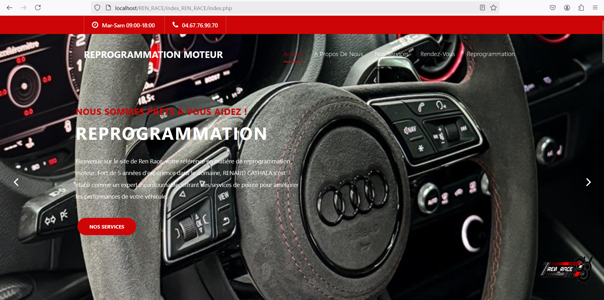
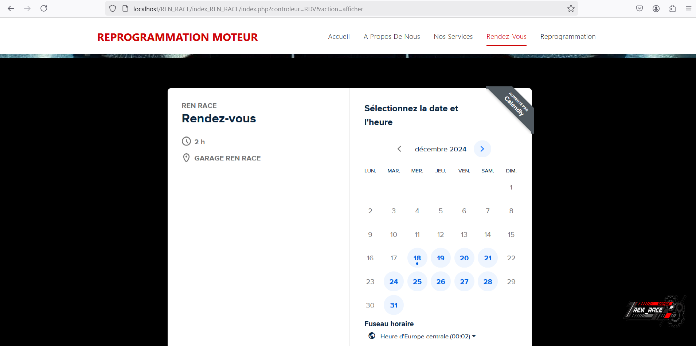
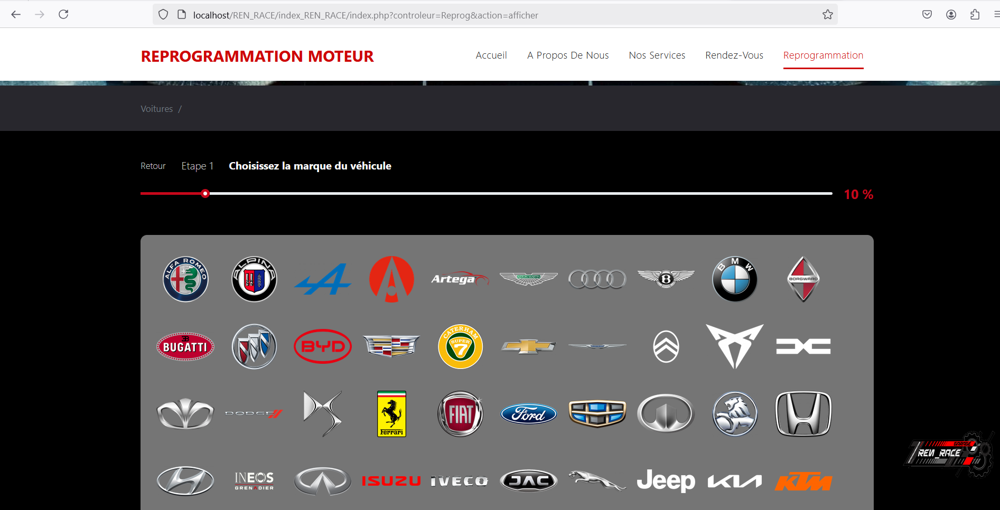
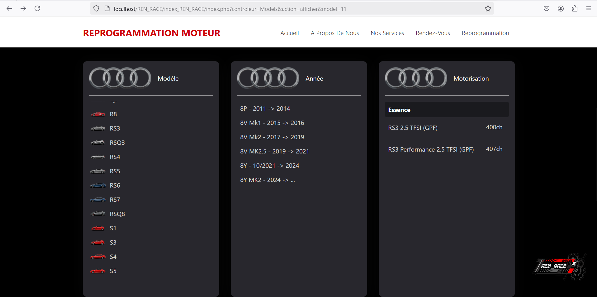
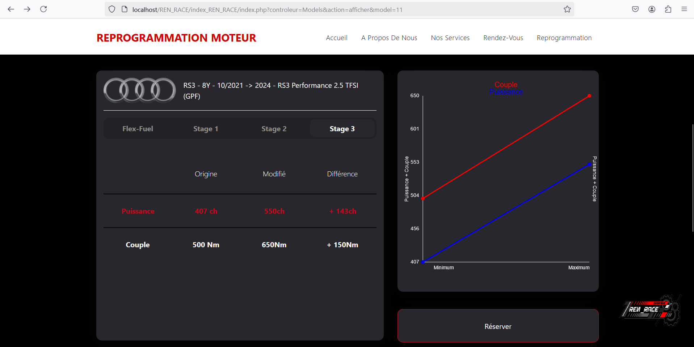

# 🚗 Reprogrammation Véhicules

Un projet web permettant de sélectionner des marques, modèles, années et motorisations de véhicules pour une reprogrammation automobile personnalisée, incluant un système de prise de rendez-vous.

---

## 📋 Description

Ce projet propose une interface utilisateur intuitive pour la sélection de véhicules et permet aux utilisateurs de prendre rendez-vous en ligne pour une reprogrammation automobile. Le processus est clair et structuré, guidant l’utilisateur à travers plusieurs étapes : **marque**, **modèle**, **année** et **motorisation**.

---

## 🚀 Fonctionnalités

- **Affichage dynamique des modèles** :  
  Les modèles sont chargés dynamiquement via **PHP/JSON**.

- **Navigation intuitive** :  
  Conception responsive avec **Bootstrap**.

- **Système de prise de rendez-vous** :  
  Permet aux utilisateurs de planifier un créneau pour la reprogrammation.

- **Progression par étapes** :  
  Suivi visuel grâce à une **barre de progression**.

- **Fallback d’images** :  
  Gestion des cas où les images ne sont pas disponibles.

---

## 💻 Technologies

- **HTML5/CSS3** : Structure et design.  
- **Bootstrap** : Design responsive et moderne.  
- **PHP** : Logique serveur et traitement des formulaires.  
- **JSON** : Données dynamiques pour les modèles de véhicules.  

---

## ⚙️ Installation

### 1️⃣ **Prérequis**

- Serveur local (**XAMPP**, **WAMP**, **MAMP**, etc.)  
- **PHP 7.4** ou supérieur  

### 2️⃣ **Cloner le projet**

```bash
git clone https://github.com/GabrielBDN/reprogrammation-vehicules.git
cd reprogrammation-vehicules
```

### 3️⃣ **Lancer l’application**

1. **Place le dossier** dans **htdocs** (ou équivalent).  
2. **Démarre ton serveur local** et accède à :  
   **[http://localhost/reprogrammation-vehicules/index.php](http://localhost/reprogrammation-vehicules/index.php)**

---

## 📂 **Structure du projet**

```bash
/reprogrammation-vehicules
│
├── index.php              # Page principale
├── models.php             # Sélection des modèles
├── rendezvous.php         # Page de prise de rendez-vous
├── assets/
│   ├── css/               # Fichiers CSS
│   ├── js/                # Scripts JavaScript
│   └── images/            # Images des marques et modèles
├── api/                   # Données simulées (JSON)
└── README.md              # Documentation
```


---

## 🖼️ **Captures d’écran**

Voici quelques captures d'écran de l'application :







---

## 🚫 **Conditions d'utilisation**

Ce projet est **privé** et ne doit en aucun cas être réutilisé, modifié ou vendu sans l’accord de l’auteur.  
⚠️ **Toute utilisation commerciale est strictement interdite.**

---

## 🛠️ **Auteur**

**Gabriel BEDUNEAU**  

- [GitHub](https://github.com/GabrielBDN)  
- [Email](mailto:gabriel.beduneau1@gmail.com)  

---

## 📢 **Important**

⚠️ **Ce projet est strictement privé.**  
Toute reproduction ou utilisation non autorisée est interdite.

